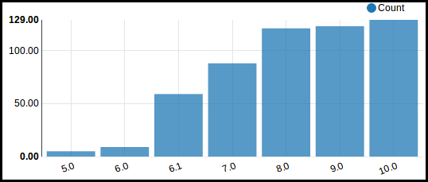
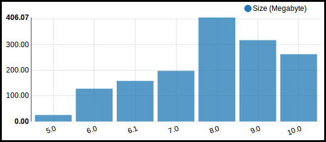

Initial upload from Github
~~~~~~~~~~~~~~~~~~~~~~~~~~

To fetch information from Github, you have to:

#. go to 'Github' / 'Settings' / 'Sync Object'
#. Select the object type you want to synchronize and its Gthub name

   .. image:: ../static/description/sync_organization.png

#. Once done for your organization(s), go to 'Github' / 'Github Commnunity' /
   'Organizations'

   .. image:: ../static/description/github_organization_kanban.png

#. Optionally, once organization is created, you can create series for your
   projects. Go to 'Github' / 'Organizations' / click on your organization /
   'Organization Series' Tabs

   .. image:: ../static/description/github_organization_series.png

Select branches to download
~~~~~~~~~~~~~~~~~~~~~~~~~~~

This setting will prevent to download undesired branches, downloading only
main branches (releases):

#. In the 'Settings' tab, set repositories you don't want to download
   (or repositories you want to download). If 'Specific repositories' is set,
   'Ignored Repositories' value is ignored.

#. In the 'Settings' tab, set the URL of the 'External Services' you use
   for Continuous Integration and Coverage.

   .. image:: ../static/description/github_organization_external_services.png

#. Once done, click on buttons 'Syncs', to synchronize repositories, teams and
   members. (This process can take a while depending of your size)

   .. image:: ../static/description/github_organization_sync_buttons.png

Team / members synchronization
~~~~~~~~~~~~~~~~~~~~~~~~~~~~~~

You can synchronize members teams:

#. Go to 'Teams' / tree view / 'Actions' / 'Update from Github'.

   .. image:: ../static/description/github_team_kanban.png

#. In each team, you can see the members list and the role of the members

   .. image:: ../static/description/github_team_partner_kanban.png

#. In each team, you can see the repositories list but not the permissions of the
   team. (See 'Known Issues' Section)

   .. image:: ../static/description/github_team_repository_kanban.png

Repositories synchronization
~~~~~~~~~~~~~~~~~~~~~~~~~~~~

You can synchronize the branches of your repositories:

#. Go to 'Repositories' /
   tree view / 'Actions' / 'Update from Github'

   .. image:: ../static/description/github_repository_kanban.png

#. In each repository, you can see the main branches list and the size of code
   source.

   .. image:: ../static/description/github_repository_branch_kanban.png

Fetching the source code
~~~~~~~~~~~~~~~~~~~~~~~~

Finally, you can download locally the source code of all your branches:

#. Go to 'Repository Branches' / tree view / 'Actions' / 'Download and Analyse Source Code'.

   .. image:: ../static/description/wizard_download_analyze.png

#. In the tree view you can update manually source code or refresh analysis.

   .. image:: ../static/description/github_repository_branch_list.png

Data creation in Github
~~~~~~~~~~~~~~~~~~~~~~~

You have the possibility to creates two items in Github directly from Odoo

#. Teams:

   #. Go to 'Settings' / 'Create Team in Github'.
   #. Set the information and click on Create in Github.
   #. Odoo will try to create the team. If access right and datas are correct,
      the creation will be done directly in Github
   #. Later on, a synchronization will be performed, to create the according
      team in the Odoo instance.

   .. image:: ../static/description/wizard_create_team.png

#. Repositories:

   #. Go to 'Settings' / 'Create Team in Github'.
   #. Set the information and click on Create in Github.

   .. image:: ../static/description/wizard_create_repository.png

Note
~~~~

Analysis in this module is basic: for the time being, it just gives branches
size.

Nevertheless, you can develop an extra Odoo Custom module to extend analysis
function and get extra statistics, depending on your needs.

In that way, you can see the module github_connector_odoo, if your repositories
contain Odoo modules.

Reporting
~~~~~~~~~

This module provides several reports

**Branches by Serie**

**Sizes by Serie**

